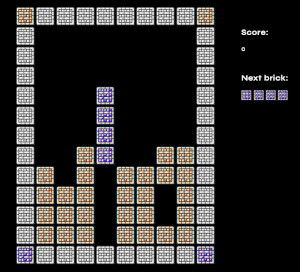

# Tetris on Rails

Game developed for the ticket contest for Euruko 2023.



**Disclaimer:** This code was created for fun and for fun only. It has obvious design flaws and is not perfect by any standards. But it was awesome to write and to share with all Euruko fans.

## How to play

Organize bricks and answer questions.

Gl & HF !

## How to install
```
$ bundle
$ rails db:create
$ rails db:migrate
```

## How to run locally
```sh
# 1st terminal
$ rails s

# second terminal
$ rails game:start
```

or with foreman

```sh
$ gem install foreman
$ PORT=3000 foreman start
```

then open `http://localhost:3000`

## How to debug

Increase logging level of the game loop by changing the log level.

```sh
LOG_LEVEL=debug rails game:start
```
